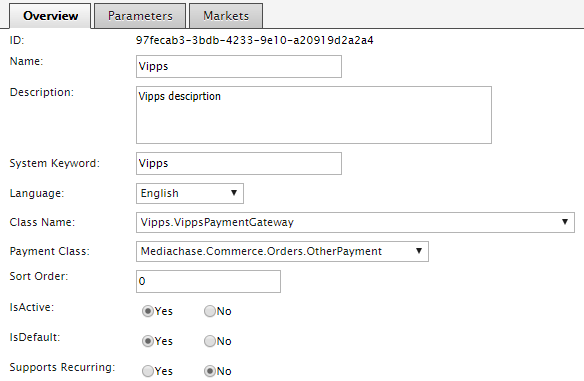
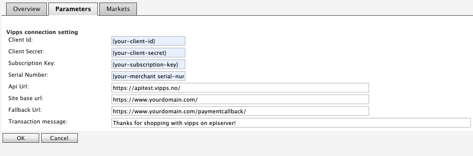

# Install and configure

- [Installation](#installation)
- [Local development environment](#local-development-environment)
- [Configure Commerce Manager](#configure-commerce-manager)
- [Initialization](#initialization)
- [Fallback controller](#fallback-controller)
- [OrderValidation](#order-validation)
- [Polling](#polling)

## Installation

## Configure Commerce Manager

Login into Commerce Manager and open **Administration -> Order System -> Payments**. Add new payment.

## Local development environment

In order to use / work on this package locally you'll need a tool called [ngrok](https://www.ngrok.com). This tool can forward a generated ngrok URL to a localhost URL. Both Vipps regular payments as well as express payments are dependant on callbacks from Vipps.

### Overview tab

- **Name(\*)**
- **System Keyword(\*)** - Vipps(the integration will not work when something else is entered in this field)
- **Language(\*)** - allows a specific language to be specified for the payment gateway
- **Class Name(\*)** - choose **Vipps.VippsPaymentGateway**
- **Payment Class(\*)** - choose **Mediachase.Commerce.Orders.OtherPayment**
- **IsActive** - **Yes**
- **Supports Recurring** - **No** - Vipps recurring payments are not yet supported

(\*) mandatory

- select shipping methods available for this payment



### Paramaters

 - **Client Id** - Can be obtained through [portal.vipps.no](https://portal.vipps.no)
 - **Client Secret**- Can be obtained through [portal.vipps.no](https://portal.vipps.no)
 - **Subscription Key** - Can be obtained through [portal.vipps.no](https://portal.vipps.no)
 - **Serial number** - Your merchant Serial number, can be obtained through [portal.vipps.no](https://portal.vipps.no)
 - **System name** - A vendor specific identifier, usually the company name like `acme`, [more here](https://github.com/vippsas/vipps-ecom-api/blob/master/vipps-ecom-api.md#optional-vipps-http-headers)
 - **Api Url** - Vipps API URL (test or prod)
 - **Site Base Url** - The URL for your site (used to generate callback URLs, ngrok generated url if running local dev env)
 - **Fallback Url** - URL to your fallback controller



## Initialization

In your initialization module you must register the following interfaces
```
services.AddTransient<IVippsService, VippsService>();
services.AddTransient<IVippsPaymentService, VippsPaymentService>();
services.AddTransient<IVippsRequestFactory, DefaultVippsRequestFactory>();
services.AddTransient<IVippsResponseFactory, DefaultVippsResponseFactory>();
services.AddSingleton<IVippsOrderSynchronizer, DefaultVippsOrderSynchronizer>();
services.AddSingleton<IVippsOrderProcessor, DefaultVippsOrderProcessor>();
services.AddSingleton<IVippsPollingService, VippsPollingService>();
```

It is important that IVippsOrderProcessor, IVippsPollingService and IVippsOrderSynchronizer is registered as a singletons.

## Fallback controller

Must be implemented in your project.

The package automatically appends the generated order id as a query string to the specified URL. The quicksilver example implementation can be found [here](../demo/Sources/EPiServer.Reference.Commerce.Site/Features/Checkout/Controllers/PaymentFallbackController.cs)

`ProcessAuthorizationAsync` method on `IVippsPaymentService` will return the created purchase order for you if the callback from Vipps was successfull. If not, it will ensure all the correct information is on the payment and shipment objects and then create the purchase order.
**No validation against tempering with the cart line items is done within the package**

```
var result = await _vippsPaymentService.ProcessAuthorizationAsync(currentContactId, currentMarketId, cartName, orderId);
```

The method returns a `ProcessAuthorizationResponse` which contains an enum called `VippsPaymentType`, this can be set to
 - CHECKOUT - Payment was initiated from checkoutpage
 - PRODUCTEXPRESS - Payment was initiated from product page
 - CARTEXPRESS - Payment was initiated from cart page/preview
 - WISHLISTEXPRESS - Payment was initiated from wishlist page/preview
 - UNKOWN - Cart can't be found

This determines where the fallbackcontroller should redirect if `processAuthorizationResult.Processed = false`
Back to checkout, product, wishlist or cart page.

If the payment is processed and the paymenttype is `WISHLISTEXPRESS`, you might also consider finding the customers wishlist cart and deleting it in the fallback controller.

*Note that this only applies to Express payments. If you are only using Vipps in the checkout, VippsPaymentType will always be CHECKOUT and the redirect action will be determined by if the payment succeeded or not.*

The ProcessAuthorizationResponse also contains a possible error message as well as a ProcessResponseErrorType enum.
 - NONE
 - NOCARTFOUND
 - NOVIPPSPAYMENTINCART
 - FAILED
 - ORDERVALIDATIONERROR
 - EXCEPTION
 - OTHER

## Order validation

No order validation is included in this package to protect from f.ex. cart
tempering. It is **highly** recommended that you implement your own order validation.
Override the `CreatePurchaseOrder` method in the `DefaultVippsOrderProcessor` class.

## Polling

The package includes polling the Vipps API to ensure that the payment is handled, even if user closes the browser tab before redirect and a callback from Vipps is not received.
 - Polling is started when a user is redirected to Vipps.
 - Polling is active for up to ten minutes
 - If a payment has a status that we can act upon polling stops.
 - Set polling interval by adding `Vipps:PollingInterval`  app setting in web config (in milliseconds). Default is 2000 ms.

### Initialize polling
```
[InitializableModule]
[ModuleDependency(typeof(EPiServer.Commerce.Initialization.InitializationModule))]
internal class VippsPollingInitialization : IInitializableModule
{
	public void Initialize(InitializationEngine context)
    {
       PollingInitialization.Initialize(context);
    }

    public void Uninitialize(InitializationEngine context)
    {
		
    }
}
```

**Example:** (assuming MyOrderService handles all the order validation)

```
public override async Task < ProcessOrderResponse > CreatePurchaseOrder(ICart cart) {
	try {
		var respone = _myOrderService.CreatePurchaseOrder(cart);

		if (response.Success) {
			return new ProcessOrderResponse {
				PurchaseOrder = response.PurcaseOrder
			};
		}

		return new ProcessOrderResponse {
			ProcessResponseErrorType = ProcessResponseErrorType.ORDERVALIDATIONERROR,
			ErrorMessage = respone.Message
		};
	}
	catch(Exception ex) {
		_logger.Error(ex.Message);
		return new ProcessOrderResponse {
			ErrorMessage = ex.Message,
			ProcessResponseErrorType = ProcessResponseErrorType.EXCEPTION
		};
	}
}
```